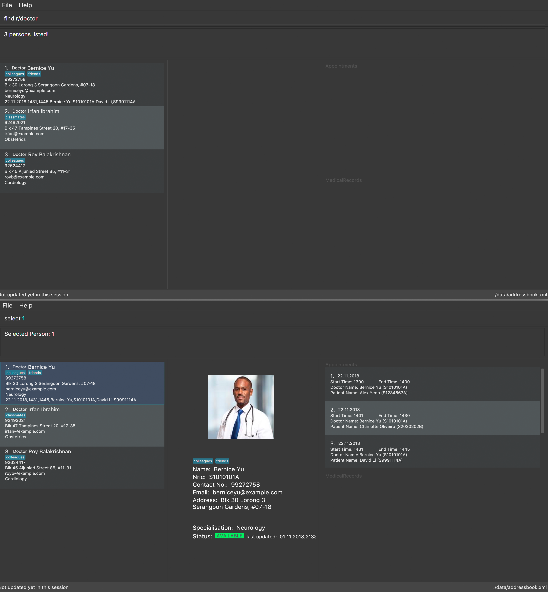

= One Life
ifdef::env-github,env-browser[:relfileprefix: docs/]

https://travis-ci.org/CS2103-AY1819S1-W16-3/main[image:https://travis-ci.org/CS2103-AY1819S1-W16-3/main.svg?branch=master[Build Status]]
https://ci.appveyor.com/project/ngkangtze/main[image:https://ci.appveyor.com/api/projects/status/fvwr0x7ve79a7vih/branch/master?svg=true[Build status]]
https://coveralls.io/github/ngkangtze/main?branch=master[image:https://coveralls.io/repos/github/ngkangtze/main/badge.svg?branch=master[Coverage Status]]
https://www.codacy.com/app/ngkangtze/main?utm_source=github.com&utm_medium=referral&utm_content=ngkangtze/main&utm_campaign=Badge_Grade[image:https://api.codacy.com/project/badge/Grade/ca0ba8031ca64e418529ffb3ee92dbe8[Codacy Badge]]
https://gitter.im/se-edu/Lobby[image:https://badges.gitter.im/se-edu/Lobby.svg[Gitter chat]]

ifdef::env-github[]

endif::[]

ifndef::env-github[]

endif::[]

* This is a desktop Address Book application. It has a GUI but most of the user interactions happen using a CLI (Command Line Interface).
* It is an application intended for medical professionals to accelerate their working processes.
* Features include:
** Quick and User-Friendly Patient Management
*** Add/Edit/Delete Patient details
*** Instantly locate Patients in the Database
** High Resistance to User Error
*** Undo/Redo Actions for all data modification commands
*** Display chronological history of user actions

== Site Map

* https://github.com/CS2103-AY1819S1-W16-3/main/blob/master/docs/UserGuide.adoc[User Guide]
* https://github.com/CS2103-AY1819S1-W16-3/main/blob/master/docs/DeveloperGuide.adoc[Developer Guide]
* https://github.com/CS2103-AY1819S1-W16-3/main/blob/master/docs/AboutUs.adoc[About Us]
* https://github.com/CS2103-AY1819S1-W16-3/main/blob/master/docs/ContactUs.adoc[Contact Us]

== Acknowledgements

* Based off the AddressBook-Level4 project created by SE-EDU initiative at https://github.com/se-edu/.

== Licence : link:LICENSE[MIT]
